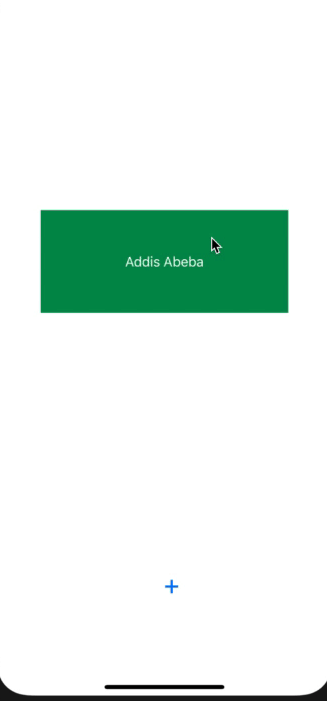

## Lab 2

Basic flashcard app that lets the user make their own flash card.

 

## Required
- [X] Create New Project in Xcode
- [X] Add a view for the front side of the flashcard to display the question
- [X] Add a view for the back side of the flashcard to display the answer
- [X] Build in logic to show the answer side when the card is tapped
- [X] Push code to GitHub
- [X] Toggle the flashcard between the question side and the answer side
- [X] Style the question and answer side of the card to better distinguish between the two sides
- [X] User can open the creation screen
- [X] User can cancel out of the creation screen
- [X] User can enter a new question and answer in the creation screen to then show it on the flashcard
- [X] Push code to GitHub
- [X] User gets an error if they try to create a new flashcard with no question or answer
- [X] User can edit existing flashcard
