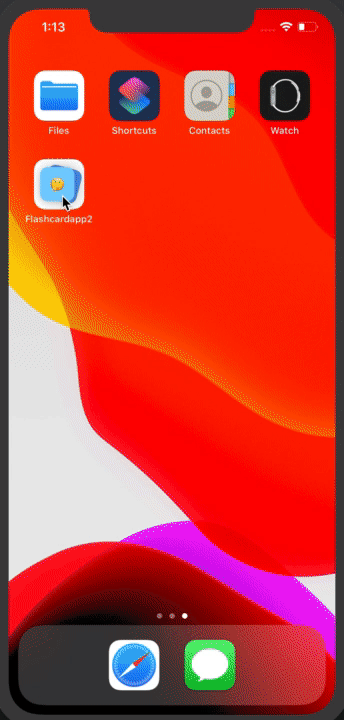

## Lab 4

A great flashcard application that can help students improve study habits by making custom flash cards. 
If you're interested in using this application you can see instructions on how to use it on your 
ios device <a href="https://www.youtube.com/watch?v=bqh6YaMxgbE"> here </a>.  

 

## Required
- [X] Create New Project in Xcode
- [X] Add a view for the front side of the flashcard to display the question
- [X] Add a view for the back side of the flashcard to display the answer
- [X] Build in logic to show the answer side when the card is tapped
- [X] Push code to GitHub
- [X] Toggle the flashcard between the question side and the answer side
- [X] Style the question and answer side of the card to better distinguish between the two sides
- [X] User can open the creation screen
- [X] User can cancel out of the creation screen
- [X] User can enter a new question and answer in the creation screen to then show it on the flashcard
- [X] Push code to GitHub
- [X] User gets an error if they try to create a new flashcard with no question or answer
- [X] User can edit existing flashcard
- [X] User should see the app icon 
- [X] User should see a splash screen
- [X] User should see an flip animation when revealing the answer
- [X] User should see a slide animation when going to the next flashcard
- [X] User should see a slide animation when going to the previous flashcard
- [X] User should see a nicer flaschard with rounded corners, shadows, and animating when showing the first time
- [X] Correct answer in multiple choice should be random
